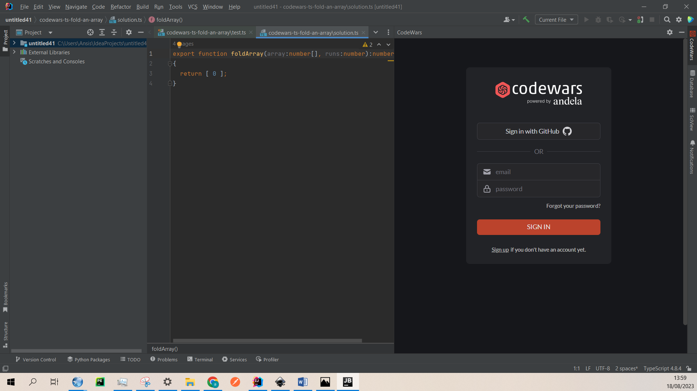
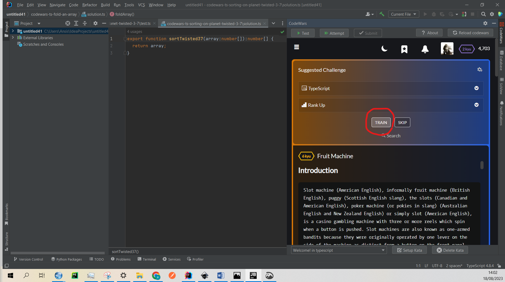

# CodeWars Plugin

This plugin imports codewars katas into Intellij and allows easy kata testing and submission directly from the IDE.
This plugin currently supports:
+ **Java** in Intellij community and ultimate
+ **Kotlin** in Intellij community and ultimate
+ **Groovy** in Intellij community and ultimate
+ **Python** in PyCharm, Intellij community and ultimate
+ **JavaScript** and **Typescript** in Intellij ultimate and WebStorm
+ **Ruby** in Intellij ultimate and RubyMine.

This plugin features a fully functional browser tab. 

Kata imports are triggered when the browser is directed to: https://www.codewars.com/kata/id/train/language
Essentially, every time you click "train" in the browser tab, the kata files will be created and opened in the current project

Further instructions on how to use the plugin can be found in the plugins "About" tab.

Currently, <u> the plugin is still work in progress </u>. Plugin is available in the Intellij marketplace. In addition, you can easily install it from the disk. The whole process takes less than 2 minutes.
Below are the installation instructions:

1. clone the repo and open the plugin project in Intellij
2. let the Gradle download dependencies and build the project (go to the Gradle tab and select Tasks/build/build)
3. after the build your project will contain the build directory. The compiled plugin: build/libs/CodeWarsPlugin-1.0-SNAPSHOT.jar
4. copy the absolute path to the build/libs/CodeWarsPlugin-1.0-SNAPSHOT.jar
5. In Intellij now open File/Settings/Plugins and click "gear wheel" button, then click "Install plugin from disk" and paste the path to CodeWarsPlugin-1.0-SNAPSHOT.jar

Below are images to illustrate the plugin installation process.
For suggestions, comments or bugreports email me at maleckisansis@gmail.com.
You are also welcome to contribute to the project.

### Build the Project

 

### Copy the Path of the Compiled Plugin

 

### Install the Plugin from the Disk 

